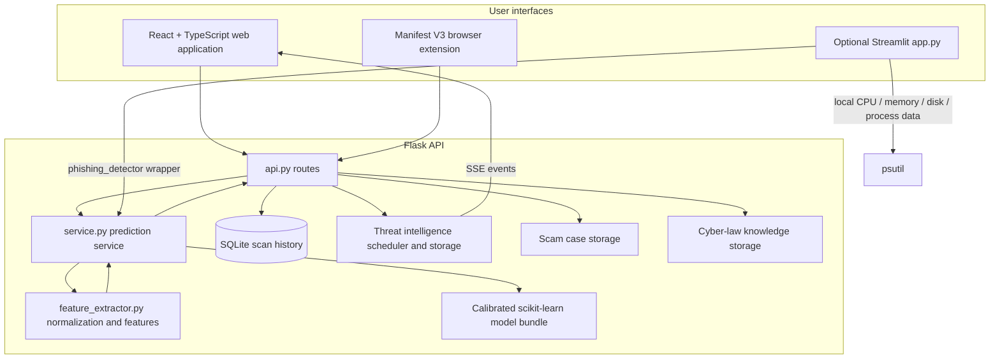
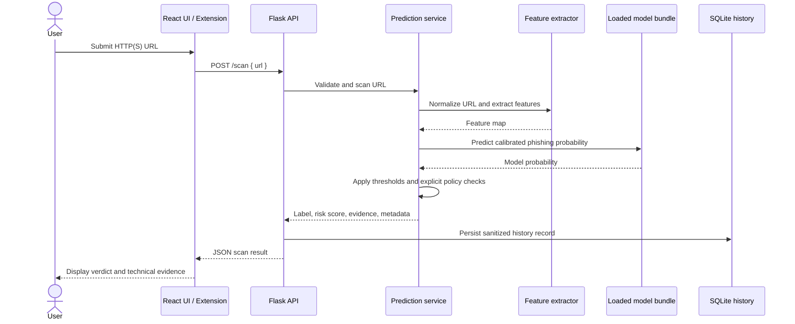
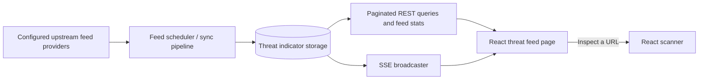
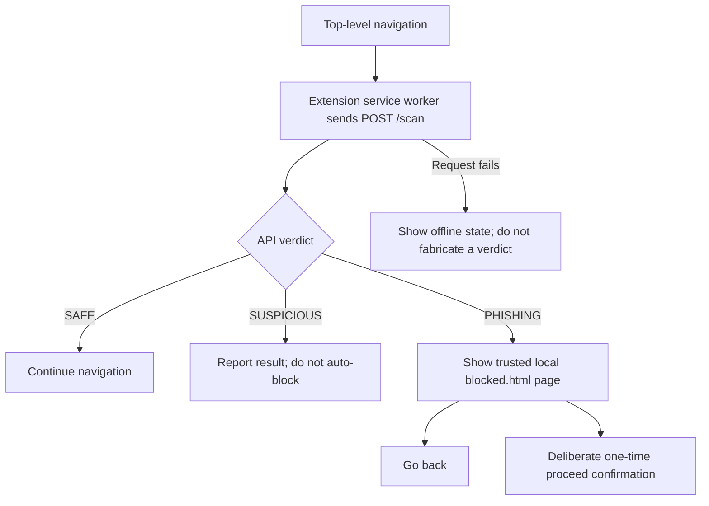
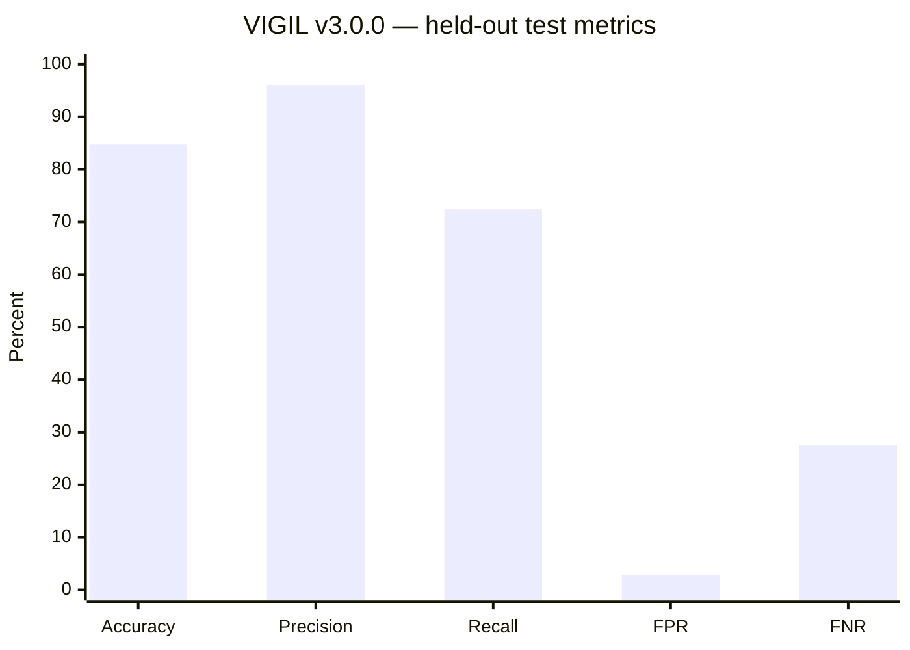

<p align="center">
  
</p>

<p align="center">
  
</p>

<p align="center">
  
  
  
  
  
  
</p>

<p align="center">
  <strong>Analyze a URL. Understand the risk. Investigate the context.</strong><br />
  A multi-interface cybersecurity project combining URL-focused phishing classification, local system telemetry, a streaming threat-intelligence feed, scam case studies, and cyber-law reference material.
</p>

<p align="center">
  <a href="#quick-start">Quick start</a> ·
  <a href="#architecture">Architecture</a> ·
  <a href="#machine-learning-model">Machine learning</a> ·
  <a href="#api-reference">API reference</a> ·
  <a href="#security-notes">Security notes</a>
</p>

---

> **Project status:** Research / development prototype. The repository contains multiple entry points and some older documentation. This README treats the checked-in `model_metadata.json` and the implementation on the `final` branch as the source of truth for the active model and current API behavior. It does not imply that the system is production-hardened or that a public deployment is available.

## Contents

- [Overview](#overview)
- [Capabilities](#capabilities)
- [Architecture](#architecture)
- [URL scan lifecycle](#url-scan-lifecycle)
- [Technology stack](#technology-stack)
- [Quick start](#quick-start)
- [Optional Streamlit dashboard](#optional-streamlit-dashboard)
- [Browser extension](#browser-extension)
- [Machine-learning model](#machine-learning-model)
- [Dataset and split audit](#dataset-and-split-audit)
- [Evaluation results](#evaluation-results)
- [REST API reference](#rest-api-reference)
- [Configuration](#configuration)
- [Testing and quality checks](#testing-and-quality-checks)
- [Project layout](#project-layout)
- [Security notes](#security-notes)
- [Limitations](#limitations)
- [Troubleshooting](#troubleshooting)
- [Roadmap](#roadmap)
- [Contributing](#contributing)
- [License](#license)

## Overview

**VIGIL AI** is a cybersecurity learning and analysis platform built around a URL-only phishing classifier. It converts the structure of an HTTP or HTTPS URL into deterministic features, evaluates those features with a calibrated scikit-learn model, and returns a `SAFE`, `SUSPICIOUS`, or `PHISHING` decision with a risk score and supporting evidence.

The wider repository contains more than the classifier. The `final` branch also includes a React + TypeScript web interface, a Flask API, a Manifest V3 browser extension, an optional Streamlit interface named **VIGIL + NeuroGuard AI**, local scan history and analytics, a server-sent-events (SSE) threat feed, scam case records, and cyber-law knowledge endpoints.

The design goal is to make security signals easier to inspect and discuss. VIGIL is **not** a guarantee that a website is safe, a replacement for browser protections, or a complete security operations platform.

### Why URL-only analysis?

URL structure can provide useful signals before navigation: hostname depth, URL length, unusual encoding, user information embedded before a hostname, explicit ports, IP-literal hosts, shortened links, suspicious tokens, and high character entropy. These signals can help prioritize a URL for review.

They are not conclusive. Legitimate sites can have long or unusual URLs, while carefully constructed phishing links can look ordinary. VIGIL therefore returns a risk assessment rather than proof of intent.

## Capabilities

| Area | What is present in the repository | Important boundary |
|---|---|---|
| URL phishing analysis | Normalization, structural feature extraction, calibrated classifier, three-way verdict, risk score, and evidence records | It inspects the URL string; it does not fetch or execute the target page during a scan |
| React web application | Scan workflow, technical result view, threat feed, scam broadcasts, legal knowledge, history, analysis, and about pages | Requires the Flask service and its data/model files to be available |
| Browser extension | Manifest V3 client that sends scan requests to the local Flask API and shows a blocking interstitial for `PHISHING` results | `SUSPICIOUS` results are surfaced but are not automatically blocked; backend failures are treated as offline states |
| NeuroGuard system monitor | Optional Streamlit interface displaying CPU, memory, disk, and top process resource use through `psutil` | It reports local host telemetry, not endpoint threat detection or GPU telemetry |
| Threat intelligence feed | Indicator listing/filtering, feed statistics and source status, manual sync endpoint, and SSE updates | Freshness and availability depend on upstream providers and network access |
| Scam case library | Searchable and filterable case records, case detail routes, statistics, attack-chain/recovery information where available | Treat records as awareness material and independently verify critical claims |
| Cyber-law knowledge | Instruments, scenarios, glossary, citizen guides, and cross-category search | Informational only; not legal advice. Confirm current law and procedure from official sources |
| Scan history and analytics | SQLite-backed scan history, history clearing, all-history verdict counts, and a seven-day UTC trend | Local records are not a cloud analytics service; `/history` returns at most the latest 100 rows |
| Model lifecycle artifacts | Model metadata, feature list, training/evaluation scripts, reports, and artifact integrity checks | Historical reports are not necessarily for the currently loaded model version |

### Verdict meanings

| Label | Meaning | Recommended response |
|---|---|---|
| `SAFE` | The effective score is below the configured safe threshold, or a narrow explicit local/official-route policy applies | Do not interpret this as a certificate of legitimacy; use normal security judgement |
| `SUSPICIOUS` | The effective score is at or above the safe threshold but below the phishing threshold | Pause and verify the destination through an independent trusted channel |
| `PHISHING` | The effective score meets or exceeds the phishing threshold | Do not proceed unless the destination has been independently verified |

The model score and the effective decision probability are returned separately. Certain explicit policies, such as loopback-host handling or an exact approved official route, can alter the effective decision while preserving the raw calibrated model probability for audit.

## Architecture

The `final` branch has two user-interface paths. The React application and browser extension call the Flask REST API. The optional Streamlit dashboard is a separate local entry point: it reads system statistics with `psutil` and invokes the Python phishing-detector wrapper directly.



### Component responsibilities

- **`api.py`** defines the Flask routes, request validation at the route boundary, SQLite scan history, analytics, threat-feed endpoints, scam-case endpoints, and legal-knowledge endpoints. It initializes the feed subsystem and normally starts its scheduler during backend startup.
- **`service.py`** is the central URL-inference path used by the API. It normalizes input, calls the feature extractor, loads the model bundle, verifies recorded artifact hashes when available, applies model thresholds and explicit local/official-route policies, and prepares structured evidence.
- **`feature_extractor.py`** normalizes HTTP(S) URLs and extracts deterministic lexical/structural signals from the URL string.
- **`model_metadata.json`**, **`phishing_model.pkl`**, and **`feature_names.pkl`** form the active inference bundle expected at the repository root.
- **`frontend/`** provides the React client and dashboard navigation. Its API client uses `VITE_API_BASE_URL`, defaulting to `http://localhost:5000`.
- **`extenison/`** is the directory name used by the existing Manifest V3 extension. Its spelling is retained so the documented path matches the repository.
- **`app.py`** contains the optional Streamlit “VIGIL + NeuroGuard AI” interface. It has a local system-monitor tab and a separate phishing-analysis tab.
- **Threat feed, scam-case, and legal-knowledge modules** provide the data/services consumed by their corresponding Flask route groups.

### Data-flow diagram: URL scanning



The React scan screen shows an animated sequence of explanatory stages while the request is in flight. Those UI stages are not a live trace of internal model execution or a training-progress monitor.

### Threat-feed event flow



The scheduler is started with an initial sync by default. Set `VIGIL_DISABLE_SCHEDULER=1` before launching the API when deliberately testing without the automatic scheduler; the trade-off is that provider data will not be refreshed by that startup path.

## URL scan lifecycle

1. **Input validation.** The API expects a JSON object with a non-empty `url`. The URL must parse correctly and use `http://` or `https://`; the service rejects invalid schemes, malformed escapes, invalid host labels, invalid ports, and overlong URLs.
2. **Canonicalization.** Hostname case, trailing dots, internationalized domain names, and IP literals are normalized to make feature extraction consistent.
3. **Feature extraction.** Deterministic values are computed from the URL string; no page, script, or file is fetched as part of this step.
4. **Model loading.** The inference service expects the model pickle, feature-name pickle, and metadata JSON. The metadata includes artifact hashes; if a recorded hash fails verification, the bundle is rejected.
5. **Prediction.** The calibrated classifier returns a probability for the phishing class.
6. **Decision mapping.** Metadata-defined thresholds map the effective probability to `SAFE`, `SUSPICIOUS`, or `PHISHING`. Explicit policies for loopback destinations and a small list of exact official host/route combinations may affect the effective decision.
7. **Evidence.** The service emits explanatory records for observable structural signals, such as a literal IP host, userinfo, explicit port, suspicious URL token, percent encoding, deep subdomains, or HTTP without HTTPS.
8. **Persistence and response.** The API returns JSON and stores a sanitized URL form in SQLite. Query strings and fragments are removed from the persisted history record to reduce the chance of storing credentials or tokens from common URL patterns.

## Technology stack

| Layer | Technologies visible in the repository |
|---|---|
| API | Python, Flask, Flask-CORS, Gunicorn support through a `Procfile` |
| ML / data | scikit-learn, pandas, NumPy, `tldextract`, pickle-based model artifacts |
| React client | React 19, TypeScript, Vite, Tailwind CSS 4, Motion, Lucide icons |
| Browser extension | Manifest V3, JavaScript service worker, popup and blocked-page flow |
| Optional monitor | Streamlit, `psutil`, `streamlit-autorefresh` in the declared dependencies |
| Persistence | SQLite for URL scan history; dedicated stores for the feed, scam cases, and legal knowledge |
| Tests / browser QA | pytest, Vitest, jsdom, Playwright-based browser QA, Node's test runner for extension tests |

The frontend manifest declares Node.js `>=24.15.0`. `requirements.txt` does not pin a single Python version, so use a Python release compatible with the declared packages and the installed scikit-learn artifact.

## Quick start

These steps run the main Flask API and React web application locally. Use two terminals so that each process can keep its logs visible.

### 1. Clone the target branch

```powershell
git clone --branch final --single-branch https://github.com/himanshusingla7507-design/VIGIL-AI.git
cd VIGIL-AI
```

### 2. Create the Python environment

**Windows PowerShell**

```powershell
python -m venv .venv
.\.venv\Scripts\Activate.ps1
python -m pip install --upgrade pip
python -m pip install -r requirements.txt
```

If PowerShell blocks virtual-environment activation, use a shell where activation is permitted or invoke the environment interpreter directly:

```powershell
.\.venv\Scripts\python.exe -m pip install -r requirements.txt
.\.venv\Scripts\python.exe api.py
```

**Linux / macOS**

```bash
python3 -m venv .venv
source .venv/bin/activate
python -m pip install --upgrade pip
python -m pip install -r requirements.txt
```

### 3. Start the backend API

From the repository root:

```powershell
python api.py
```

By default, the development server listens at `http://127.0.0.1:5000`. Check model readiness in a second terminal:

```powershell
Invoke-RestMethod http://127.0.0.1:5000/health
Invoke-RestMethod http://127.0.0.1:5000/model-info
```

A healthy response reports `status: "ok"`, `model_loaded: true`, and the active model version. If the model bundle is missing or fails its integrity check, the health endpoint returns a degraded response and scans cannot proceed normally.

**Network note:** the threat-feed scheduler normally performs an initial sync during startup. A working network connection may be needed for current upstream feed data. To disable the automatic scheduler for a local test session:

```powershell
$env:VIGIL_DISABLE_SCHEDULER = "1"
python api.py
```

Run that environment-setting command in the same terminal immediately before starting the backend. Do not set it when your test specifically depends on an automatic feed sync.

### 4. Start the React frontend

Open a new terminal:

```powershell
cd frontend
npm install
npm run dev
```

Open the local URL printed by Vite; the configured development port is `5173`, normally `http://localhost:5173`.

The frontend API client defaults to `http://localhost:5000`. If your backend uses a different local URL, set the variable before launching Vite. Example for PowerShell:

```powershell
$env:VITE_API_BASE_URL = "http://127.0.0.1:5000"
npm run dev
```

The environment variable must be set in the frontend terminal and before `npm run dev`.

### 5. Optional Windows launcher

The repository includes `run_vigil.bat`, which opens the backend and frontend in separate command windows and opens the browser. It uses fixed startup delays; if the browser opens before either service is ready, use the manual two-terminal sequence above and check each terminal's output.

### Expected local services

| Service | Default local address | Start command |
|---|---|---|
| Flask API | `http://127.0.0.1:5000` | `python api.py` |
| React / Vite | `http://localhost:5173` | `cd frontend; npm run dev` |
| Streamlit alternative | `http://localhost:8501` | `python -m streamlit run app.py` |

No claim is made here that the repository has a currently available hosted demo. Local startup success depends on installed dependencies and the model/data files present in the clone.

## Optional Streamlit dashboard

`app.py` offers a second interface titled **VIGIL + NeuroGuard AI**. Start it from the repository root, after installing `requirements.txt`:

```powershell
python -m streamlit run app.py
```

The two tabs have distinct purposes:

- **NeuroGuard — System Monitor:** uses `psutil` to report current CPU, memory, and disk utilization and a short list of top processes by CPU/memory use. An optional refresh control reruns the dashboard.
- **VIGIL — Phishing Detector:** accepts a URL, calls the Python phishing-detector wrapper, and renders a risk-oriented result card with selected URL features. Its scan history is an in-session list capped at ten entries, separate from the Flask API's SQLite history.

This Streamlit screen is an alternate/legacy interface, not the main React dashboard. Its phishing tab also contains a hard-coded polling request to `https://vigil-hbc5.onrender.com` for an extension-provided URL. That request is separate from the React API configuration; review or remove it in `app.py` before using the Streamlit interface in a privacy-sensitive environment. Do not infer that the external endpoint is currently online just because its URL appears in source code.

## Browser extension

The Manifest V3 extension lives in the repository's `extenison/` directory. It does not bundle a separate ML model: it sends URL scans to the local VIGIL Flask API.

### Load it in Chromium-based browsers

1. Start the backend using `python api.py` and verify that `/health` succeeds.
2. Open `chrome://extensions` in Chrome or `edge://extensions` in Edge.
3. Enable **Developer mode**.
4. Select **Load unpacked** and choose the repository's `extenison/` directory.
5. Pin VIGIL and open the popup on an HTTP or HTTPS page.

The extension currently targets `http://127.0.0.1:5000`. Its listed permissions include access to the active tab URL, top-level navigation handling, short-lived storage for block-page state, and the local API host permission.

### Navigation behavior



Additional behavior documented by the extension implementation:

- Popup scans and navigation scans share the service-worker request path.
- Results are cached in memory for 30 seconds per tab and normalized URL.
- A stale response is ignored if the tab has started navigating to another URL.
- The blocked destination is displayed as text rather than loaded as an embedded page.
- The interstitial requires a deliberate one-time bypass confirmation; it does not permanently whitelist the URL.
- Extension debugging can expose scan metadata. Keep developer tools and logs out of shared or sensitive environments.

Run the extension's syntax checks and Node tests from the repository root:

```powershell
node --check extenison/background.js
node --check extenison/popup.js
node --check extenison/blocked.js
node --test extenison/extension.test.mjs
node --test extenison/background.runtime.test.mjs
```

The automated tests do not replace a manual Chromium test of safe navigation, suspicious navigation, phishing interception, back navigation, blocked-page reload, one-time bypass, and backend-offline behavior.

## Machine-learning model

### Active artifact

The checked-in `model_metadata.json` identifies the root model bundle as **v3.0.0**, with model type `DomainDisjointCalibratedHistGradientBoosting`. The serving code loads a scikit-learn histogram-based gradient-boosting estimator with sigmoid calibration via a logistic-regression calibrator. The active bundle records 29 feature names.

| Property | Value recorded in `model_metadata.json` |
|---|---|
| Model version | `v3.0.0` |
| Model type | `DomainDisjointCalibratedHistGradientBoosting` |
| Estimator family | `HistGradientBoostingClassifier` |
| Calibration | Sigmoid calibration (`LogisticRegression`) |
| Feature count | 29 |
| Training dataset path | `experiments/auto_ml/realworld_v3/sampled_dataset.csv` |
| Dataset rows recorded in metadata | 11,510 |
| Train split used to fit the estimator | 7,772 rows (3,886 label `0`; 3,886 label `1`) |
| Calibration split | 640 rows |
| Validation split | 1,020 rows |
| Held-out test split | 2,078 rows |
| Recorded training timestamp | `2026-10-09T13:25:08.570323+00:00` |

The train, calibration, validation, and test sets are recorded as registered-domain-disjoint. The test set is reserved for final evaluation and is not used in the documented threshold-selection process.

### Feature engineering

The model operates on lexical and structural URL attributes. Examples include:

| Feature family | Examples | Why it may matter |
|---|---|---|
| Length and structure | `URLLength`, `HostnameLength`, `PathLength`, `QueryLength`, `FragmentLength`, `PathSegmentCount`, `QueryParameterCount` | Helps characterize unusually long or complicated URL structures |
| Host structure | `DotCount`, `SubdomainDepth`, `IsDomainIP`, `IsShortened` | Captures host depth, IP-literal use, and recognized URL-shortener patterns |
| Character composition | `NoOfDigitsInURL`, `DigitRatioInURL`, `NoOfLettersInURL`, `LetterRatioInURL`, `URLEntropy` | Captures character distribution and complexity signals |
| URL delimiters | `NoOfEqualsInURL`, `NoOfQMarkInURL`, `NoOfAmpersandInURL`, `NoOfAtInURL`, `NoOfHyphenInURL`, `NoOfUnderscoreInURL` | Captures syntax and delimiter patterns in the URL string |
| Obfuscation and host signals | `URLPercentEncodingCount`, `HasObfuscation`, `HasUserInfo`, `HasPort` | Identifies structural patterns that warrant closer inspection |
| Lexical / suffix signals | `HasSuspiciousTLD`, `HasSuspiciousToken`, `IsTrustedTLD` | Encodes selected suffix and lure-token signals |

The 29 feature names used by the active artifact are:

<details>
<summary>Show the complete active feature list</summary>

```text
URLLength
HostnameLength
PathLength
QueryLength
FragmentLength
PathSegmentCount
QueryParameterCount
DotCount
SubdomainDepth
NoOfDigitsInURL
DigitRatioInURL
NoOfLettersInURL
LetterRatioInURL
NoOfEqualsInURL
NoOfQMarkInURL
NoOfAmpersandInURL
NoOfAtInURL
NoOfHyphenInURL
NoOfUnderscoreInURL
URLPercentEncodingCount
HasObfuscation
HasUserInfo
HasPort
IsDomainIP
IsShortened
HasSuspiciousTLD
HasSuspiciousToken
IsTrustedTLD
URLEntropy
```

</details>

Feature extraction is deterministic and URL-only. The extractor normalizes and validates the input before values are assembled in the exact order expected by `feature_names.pkl`. The serving code checks that feature names are unique and available before building the inference row; a mismatch causes the scan to fail rather than silently shuffling the feature columns.

### Thresholds and risk score

The active v3.0.0 metadata records these decision thresholds:

| Decision | Effective probability rule |
|---|---|
| `SAFE` | Below `0.25` |
| `SUSPICIOUS` | At least `0.25` but below `0.9106962115698227` |
| `PHISHING` | At least `0.9106962115698227` |

The exact numeric thresholds come from the checked-in model metadata and can change when the model bundle changes. The risk score scales the effective probability between the two thresholds to an integer from 0 to 100. Exact local-host and approved official-route policies can alter the effective probability, but the raw `model_probability` remains available in the response for audit.

### Artifact integrity and versioning

The serving layer expects all three files at the repository root:

- `phishing_model.pkl` — serialized model.
- `feature_names.pkl` — ordered feature-name list.
- `model_metadata.json` — version, dataset/split information, thresholds, evaluation results, and expected artifact hashes.

When hashes are present, the loader checks the model and feature-list files against the recorded SHA-256 values. It also exposes a model fingerprint through the service metadata. Pickle files must be treated as executable trusted artifacts: do not load model bundles from unknown sources.

## Dataset and split audit

A key distinction in this repository is that **the largest corpus in the repository is not the number of rows used to fit the active v3.0.0 model**.

### Recorded active-model data

| Dataset / split | Rows | Class distribution where recorded | Purpose |
|---|---:|---|---|
| v3.0.0 source dataset | 11,510 | 5,755 label `0` / 5,755 label `1` | Source sample recorded in model metadata |
| Train | 7,772 | 3,886 / 3,886 | Fit the candidate estimator |
| Calibration | 640 | 320 / 320 | Calibrate predicted probabilities |
| Validation | 1,020 | 510 / 510 | Select/check decision thresholds |
| Held-out test | 2,078 | 1,039 / 1,039 | Report final offline performance |
| **Total across splits** | **11,510** | **Balanced by split** | Domain-disjoint split contract |

The metadata records **4,373 registered domains** in the source dataset and 2,852 / 265 / 439 / 817 registered domains across the train / calibration / validation / test splits. Domain separation reduces direct leakage from the same registered domain appearing across different splits. It does not establish performance on future campaigns or on live traffic.

### Separate large corpus: 854,870 rows

`docs/API.md` documents a separate `data/processed/clean_dataset.csv` corpus containing 854,870 rows. It is associated in the repository's audit notes with a different candidate artifact that is marked missing. It is therefore **not presented here as the direct fit dataset of the active v3.0.0 model**. Do not use the large-corpus count as a training-sample count or as evidence of model quality.

### Repository metadata that needs reconciliation

Some historical documentation still describes model `v2.1.0`, a `final_dataset_v2.csv` source, and metrics from an earlier evaluation. In contrast, the active `model_metadata.json` and the v3.0.0 API documentation describe the root bundle above. The checked-in `reports/metrics.json` also records `blocked_model_dataset_mismatch` for an evaluation candidate, rather than publishing those mismatched results as current metrics.

For reproducible work, use the following order of authority:

1. The actual loaded artifact and `GET /model-info` response.
2. Root `model_metadata.json` and its recorded hashes.
3. Version-matched evaluation artifacts and scripts.
4. Older README text or reports that still refer to v2.1.0.

The active model metadata establishes a dataset path and checksum, but that does not on its own prove upstream collection rights, redistribution licensing, temporal freshness, or representativeness. Verify provenance before distributing training data or using it for high-impact decisions.

## Evaluation results

The active metadata records the following **offline held-out test** results for model v3.0.0:

| Metric | Recorded test result | Interpretation |
|---|---:|---|
| Accuracy | 84.74% | Share of all test examples classified correctly |
| Precision | 96.16% | Of predicted phishing examples, share labeled phishing in this test set |
| Recall | 72.38% | Share of phishing examples detected in this test set |
| F1-score | 0.8259 | Harmonic mean of precision and recall |
| ROC-AUC | 0.9533 | Ranking discrimination over the test examples |
| False-positive rate | 2.89% | Legitimate examples incorrectly classified as phishing at the selected threshold |
| False-negative rate | 27.62% | Phishing examples not classified as phishing at the selected threshold |
| Test samples | 2,078 | Balanced, held-out, registered-domain-disjoint examples |

Recorded confusion matrix (rows are actual label `0` / label `1`; columns are predicted label `0` / label `1`):

| | Predicted label 0 | Predicted label 1 |
|---|---:|---:|
| Actual label 0 | 1,009 | 30 |
| Actual label 1 | 287 | 752 |



The chart is a visualization of the recorded offline metrics, not a live dashboard. The held-out set is balanced by construction, so its precision and accuracy are not expected to equal measurements on a real population where phishing prevalence can be much lower or shift over time. No temporal evaluation is recorded in the active metadata, and no independent live-phishing guarantee should be inferred from ROC-AUC alone.

The threshold-selection note states that the validation split was used to select recall subject to a false-positive-rate constraint; the held-out test split was not used for threshold selection. The recorded validation false-positive rate is approximately 1.37%, while the held-out test false-positive rate is approximately 2.89%.

## REST API reference

The API is served by Flask at `http://127.0.0.1:5000` by default. JSON endpoints are listed below based on route definitions in `api.py` and the frontend API client. Query parameters are optional unless stated otherwise.

### Core scanning and history

| Method | Endpoint | Purpose |
|---|---|---|
| `GET` | `/` | Basic service status response |
| `GET` | `/health` | Model readiness; returns a degraded status if the bundle cannot load |
| `GET` | `/model-info` | Active model, feature, split, hash, threshold, and evaluation metadata |
| `POST` | `/scan` | Analyze one URL and return a verdict, score, features, and evidence |
| `GET` | `/history` | Latest 100 stored scans |
| `GET` | `/history/<id>` | Retrieve one history item by integer ID |
| `DELETE` | `/history` | Clear local scan history |
| `GET` | `/analysis/scan-analytics` | Aggregate all stored scan verdicts and a seven-day UTC trend |

### Threat intelligence

| Method | Endpoint | Purpose |
|---|---|---|
| `GET` | `/threat-feed/indicators` | Paginated indicator query; supports `page`, `limit`, `source`, `category`, `status`, and `q` |
| `GET` | `/threat-feed/stats` | Aggregated feed statistics |
| `GET` | `/threat-feed/sources` | Current provider/source health information |
| `GET` | `/threat-feed/stream` | SSE stream for new indicators and feed updates; supports event reconnection metadata |
| `POST` | `/threat-feed/sync?limit=150` | Trigger an on-demand sync (the `limit` parameter can be changed) |
| `POST` | `/threat-feed/test-inject` | Inject a synthetic/test indicator into the live stream; development/testing only |

### Scam case library

| Method | Endpoint | Purpose |
|---|---|---|
| `GET` | `/scam-cases` | List and filter cases using `page`, `limit`, `scam_type`, `status`, `severity`, and `q` |
| `GET` | `/scam-cases/<id_or_slug>` | Retrieve a case record by ID or slug |
| `GET` | `/scam-cases/stats` | Return stored case-library statistics |

### Cyber-law knowledge

| Method | Endpoint | Purpose |
|---|---|---|
| `GET` | `/legal-knowledge/instruments` | List legal instruments; supports `category` and `q` |
| `GET` | `/legal-knowledge/instruments/<id>` | Retrieve one instrument and its reference details |
| `GET` | `/legal-knowledge/scenarios` | Search or list cyber scenarios mapped to relevant legal provisions |
| `GET` | `/legal-knowledge/scenarios/<id>` | Retrieve one scenario |
| `GET` | `/legal-knowledge/glossary` | Search/list cyber-law glossary terms using `q` |
| `GET` | `/legal-knowledge/guides` | List citizen action guides; supports `category` |
| `GET` | `/legal-knowledge/search?q=<query>` | Cross-search instruments, scenarios, glossary terms, and guides |

### Example: scan a URL

**PowerShell**

```powershell
$body = @{ url = "https://example.com" } | ConvertTo-Json
Invoke-RestMethod `
  -Uri "http://127.0.0.1:5000/scan" `
  -Method Post `
  -ContentType "application/json" `
  -Body $body
```

**curl**

```bash
curl -X POST http://127.0.0.1:5000/scan \
  -H 'Content-Type: application/json' \
  -d '{"url":"https://example.com"}'
```

### Example response shape

Exact probabilities, evidence, and feature values depend on the submitted URL and the active bundle. This reduced example shows the shape rather than asserting a fixed verdict for every URL:

```json
{
  "url": "https://example.com",
  "normalized_url": "https://example.com/",
  "label": "SAFE",
  "risk_score": 0,
  "probability": 0.12,
  "model_probability": 0.12,
  "effective_probability": 0.12,
  "probability_source": "model",
  "evidence": [],
  "features": {
    "URLLength": 20,
    "HostnameLength": 11
  },
  "model_version": "v3.0.0",
  "thresholds": {
    "safe": 0.25,
    "phishing": 0.9106962115698227
  },
  "scanned_at": "<UTC timestamp>",
  "request_id": "<request UUID>"
}
```

The illustrative probability and simplified `evidence` array above are placeholders, not a promise that `example.com` will produce that exact output on every artifact. The API may also include `reputation`, `model_fingerprint`, and other metadata fields.

### Common errors

| HTTP status | Typical cause |
|---|---|
| `400` | Invalid JSON, missing/empty URL, invalid URL, or unsupported scheme |
| `413` | URL longer than 2,048 characters or request body exceeds the configured body-size limit |
| `404` | Requested history item, scam case, legal instrument, or legal scenario does not exist |
| `503` | Model bundle unavailable or integrity/load check failed |
| `500` | Unexpected scan error; detailed filesystem information is not returned in the client response |

The API route code does not provide authentication. Keep it bound to a trusted local environment until access control, CORS, and operational hardening have been added.

## Configuration

| Variable | Default / behavior | Purpose |
|---|---|---|
| `VIGIL_PORT` | `5000` | Selects the port used by the development Flask runner |
| `VIGIL_DEBUG` | Disabled unless set to `1`, `true`, or `yes` | Enables additional backend scan diagnostics; review logs carefully because the normalized URL may include path/query data |
| `VIGIL_DISABLE_SCHEDULER` | Scheduler enabled unless set to `1`, `true`, or `yes` | Disables automatic threat-feed scheduler startup, useful for isolated tests |
| `VITE_API_BASE_URL` | `http://localhost:5000` | API base URL used by the React frontend |

The code's `CORS` initialization currently allows `*` origins. This does **not** provide authentication and should not be read as a safe production configuration. See [Security notes](#security-notes) before exposing any service beyond localhost.

## Testing and quality checks

These are the documented local checks available in the repository. They are provided as commands to run; this README has not executed them against a fresh clone.

### Python backend and data scripts

From the repository root with the virtual environment active:

```powershell
python -m pytest -q
python -m py_compile api.py service.py phishing_detector.py feature_extractor.py train_model.py prepare_dataset.py evaluate_model.py
```

The top-level training scripts belong to the repository's older/general dataset workflow and may expect an input file such as `final_dataset_v2.csv`. They should not be assumed to reproduce the active v3.0.0 artifact without first verifying the exact dataset and experiment script recorded by that artifact.

### React frontend

```powershell
cd frontend
npm test
npm run build
```

Optional browser QA (requires the API and Vite frontend to be running and Playwright's browser to be installed):

```powershell
npm run qa:browser
```

The browser script navigates through the scan, result, history, analysis, and about views; it also checks validation feedback, reduced-motion behavior, and layout overflow at several viewport widths. Its test expectations must still be rechecked if the model artifact or UI contract changes.

### Browser extension

```powershell
node --check extenison/background.js
node --check extenison/popup.js
node --check extenison/blocked.js
node --test extenison/extension.test.mjs
node --test extenison/background.runtime.test.mjs
```

### What successful checks mean

- Unit tests cover only the behavior represented in those tests.
- A frontend build validates TypeScript compilation and bundling; it does not validate all API integration behavior.
- Browser QA is an integration check against a running local backend and the checked-in model bundle.
- Offline ML metrics are not a substitute for temporal testing, independent evaluation, adversarial analysis, or deployment monitoring.

## Project layout

The following map highlights the primary entry points and artifacts; not every experimental or backup file is listed.

```text
VIGIL-AI/
├── api.py                         # Flask API, history, analytics, feed/case/law routes
├── service.py                     # Central model loading and inference decisions
├── feature_extractor.py            # URL validation, normalization, structural features
├── phishing_detector.py            # Python compatibility wrapper used by app.py
├── config.py                       # Fallback thresholds and explicit host/route policies
├── app.py                          # Optional Streamlit VIGIL + NeuroGuard interface
├── run_vigil.bat                   # Convenience launcher for backend + frontend
├── Procfile                        # WSGI-host configuration entry point
├── requirements.txt                # Python dependencies
├── phishing_model.pkl              # Active serialized ML artifact
├── feature_names.pkl               # Ordered feature names for inference
├── model_metadata.json             # Version, hashes, splits, thresholds, offline metrics
├── frontend/
│   ├── package.json                # Node engine and frontend scripts/dependencies
│   ├── vite.config.ts              # Vite development port and API route proxies
│   └── src/
│       ├── App.tsx                 # Dashboard navigation and backend health check
│       ├── pages/                  # Scan, feed, scam cases, law, history, analysis, about
│       └── services/api.ts         # Shared frontend REST and SSE client
├── extenison/                      # Manifest V3 browser extension
├── docs/
│   ├── API.md                      # Existing API notes
│   ├── ml-evaluation.md            # Historical model evaluation documentation
│   └── FALSE_POSITIVE_ANALYSIS.md  # False-positive regression analysis
├── data/processed/                 # Prepared data and audit artifacts
├── experiments/auto_ml/realworld_v3/ # Active model's recorded source-dataset path
├── reports/                        # Machine-readable evaluation and audit reports
├── models/backup/                  # Prior model bundles / backups
├── tests/ and test/                # Python and other test assets
└── scripts/                        # Data/model utilities and helper scripts
```

The active model's source dataset is recorded as `experiments/auto_ml/realworld_v3/sampled_dataset.csv`. If that file or other source data is absent from a particular clone, the checked-in trained model may still serve scans, but reproducing training requires the exact source data and compatible training workflow.

## Security notes

VIGIL is security-related software, but the current source should be treated as a local development prototype. Several implementation facts matter before deployment.

### Verified behavior

- The scan pipeline analyzes URL strings; the scan route does not automatically visit the submitted website or execute its page content.
- The Flask API validates JSON and rejects unsupported or malformed URL input.
- Request bodies have a configured maximum size, and individual scan URLs are limited to 2,048 characters in the service.
- Query strings and fragments are removed from URLs stored in the local scan-history record. The submitted URL can still be present in the scan response and should be handled as potentially sensitive data.
- The model loader checks SHA-256 values for the serialized model and feature-list artifacts when those hashes are recorded in metadata.
- The extension renders a blocked destination as text in a trusted local interstitial rather than embedding the suspicious remote page.

### Hardening required before any public deployment

1. **Restrict CORS.** `api.py` currently uses a wildcard origin policy. Replace it with an explicit allowlist for the actual trusted frontend origins.
2. **Add authentication and authorization.** The API routes do not currently enforce a user or service identity. Do not expose history-clearing, manual-sync, or test-injection routes to untrusted clients.
3. **Protect the test-injection endpoint.** `POST /threat-feed/test-inject` can add synthetic indicators. Disable it or guard it behind a development-only configuration and authorization.
4. **Add rate limits and abuse controls.** The visible route code has request-size validation, but a rate-limiting layer is not established by that alone.
5. **Review diagnostic logging.** `VIGIL_DEBUG` logs normalized URL information. URL paths and query parameters can contain reset tokens, session material, email addresses, or other sensitive values; do not enable detailed diagnostics on sensitive traffic without redaction.
6. **Validate external feed operations.** Feed synchronization makes external requests. Review provider URLs, outbound-network rules, parsing, timeouts, and failure handling before deploying it in a restricted environment.
7. **Protect local history and artifacts.** Apply file permissions and backups appropriate to the host. Never load untrusted pickle files.
8. **Separate development and production settings.** Do not assume `python api.py`, the convenience batch file, or the `Procfile` alone yields a hardened production service.

The API binds to `127.0.0.1` when started with `python api.py`, which is suitable for local development. If another server or deployment configuration binds it to a public interface, all of the above controls become more important.

### Responsible use

- Test only URLs and systems you are authorized to analyze.
- Do not enter credentials into suspected phishing pages to “confirm” a verdict.
- Do not treat `SAFE` as proof that a destination is legitimate.
- Use independent verification, domain reputation, DNS/TLS intelligence, browser protections, and human review for high-impact decisions.
- Avoid placing secrets in URLs used for demonstrations, because URLs may appear in client responses or local diagnostics.

## Limitations

- **URL-only scope:** the classifier does not inspect page HTML, JavaScript, DOM behavior, downloaded files, redirect chains, DNS, TLS certificates, or real-time page reputation during the scan.
- **False negatives:** the recorded held-out recall is approximately 72.38%; not every phishing sample in that test split was detected.
- **False positives:** legitimate URLs may contain unusual parameters, long paths, encoded values, or words also used by attackers.
- **Dataset shift:** URL conventions and phishing infrastructure change over time. The active metadata does not provide a temporal holdout evaluation.
- **Balanced evaluation data:** test precision measured on a balanced set may differ materially from precision in real traffic.
- **Dataset licensing/provenance:** hashes and file paths make an artifact traceable within the repository but do not independently establish collection rights or legal reuse terms.
- **Threat-feed availability:** a feed view is only as current as the upstream sources and sync pipeline. An empty feed does not prove that there are no threats.
- **Legal information:** the cyber-law module is a reference tool, not legal advice. Laws, regulations, official links, and reporting procedures can change.
- **Deployment hardening:** wildcard CORS and missing route authentication make the current API unsuitable for public exposure without remediation.

## Troubleshooting

### `GET /health` returns degraded or `POST /scan` returns `503`

- Confirm that `phishing_model.pkl`, `feature_names.pkl`, and `model_metadata.json` exist in the repository root.
- Inspect the backend terminal for model loading or checksum failures.
- Verify that the artifacts belong to the same model version and that the feature list matches the model.
- Do not replace one artifact independently with a file from another experiment.

### The React app cannot reach the backend

- Confirm `python api.py` is still running and `/health` returns `status: "ok"`.
- Check that the frontend API client targets the same host and port as the backend.
- If using a custom port or host, set `VITE_API_BASE_URL` before starting Vite.
- Look at browser developer tools and both terminal logs for CORS, connection-refused, or request-timeout errors.

### Threat feed is empty or stale

- Check `/threat-feed/sources` and `/threat-feed/stats` for source status.
- Verify outbound network access and the backend logs during initial sync.
- Confirm `VIGIL_DISABLE_SCHEDULER` is not set if the expected behavior requires automatic startup sync.
- Use the manual sync action only on a trusted local instance; do not expose it publicly without authentication and rate limits.

### The browser extension reports offline

- Start the local API at `http://127.0.0.1:5000`.
- Confirm the extension targets the expected local origin.
- Reload the unpacked extension after editing its files.
- Use the browser extension's service-worker console to inspect connectivity; do not interpret a request failure as a phishing prediction.

### Python dependency or pickle errors

- Use a clean virtual environment and reinstall `requirements.txt`.
- Record the Python and scikit-learn versions before changing packages.
- Pickle compatibility can depend on the Python/scikit-learn environment used to create the artifact. Keep a known-good model bundle before experimentation.

### Frontend build fails

- Check `node --version`; `frontend/package.json` declares `>=24.15.0`.
- Remove only generated frontend dependencies/build artifacts when necessary, then run `npm install` again.
- Review TypeScript errors before changing code; `npm run build` runs the TypeScript build and Vite bundling.

## Roadmap

The items below are **proposals**, not statements of completed work or promised release dates.

### Near-term priorities

- [ ] Restrict CORS to explicit frontend origins and add API authentication for non-local deployments.
- [ ] Disable or protect the threat-feed test-injection endpoint outside test mode.
- [ ] Reconcile v2.1.0 documentation, v3.0.0 metadata, and older dataset audit notes.
- [ ] Add one canonical, version-matched command for reproducing the v3.0.0 training and evaluation pipeline.
- [ ] Add regression tests for model metadata, threshold boundaries, model/feature-file mismatch, and API startup without external feeds.
- [ ] Add a clear UI/API state for stale or unavailable feed providers.

### Medium-term improvements

- [ ] Establish documented provenance, licenses, and collection dates for each dataset source.
- [ ] Add temporal and independent external evaluation, preserving registered-domain separation.
- [ ] Track false positives and false negatives from reviewed examples without collecting unnecessary user identifiers.
- [ ] Add dependency and secret scanning to continuous integration.
- [ ] Provide versioned extension packages and a repeatable release checklist.
- [ ] Add operational logs with consistent redaction, structured error monitoring, and bounded request rates.

### Longer-term research

- [ ] Evaluate drift detection and scheduled model review against new phishing campaigns.
- [ ] Compare candidate models using a fixed reproducible protocol and the same domain-separated splits.
- [ ] Explore isolated page-content analysis as an optional, separately sandboxed stage rather than silently expanding the current URL-only scan.
- [ ] Investigate privacy-preserving feedback for reviewing difficult legitimate and phishing URLs.

## Contributing

Contributions should improve correctness, reproducibility, usability, or safety—not just add features. A useful change description should make clear what behavior changes, how it was tested, and what limitations remain.

1. Create a focused branch from the target branch.
2. Make the smallest change that solves the problem.
3. Add or update tests for behavior changes.
4. Run the relevant Python, frontend, or extension checks listed above.
5. Do not commit secrets, `.env` files, local SQLite databases, virtual environments, `node_modules`, unlicensed datasets, or unrelated model binaries.
6. Open a pull request with a clear summary, steps to reproduce, test output, and screenshots only when they are captures from the actual application.

### Bug reports should include

- The operating system and Python / Node versions.
- The selected branch and model version from `/model-info`.
- The command being run and a minimal reproduction.
- Relevant error output with tokens, private URLs, usernames, and personal data redacted.
- Whether the issue affects the REST API, React app, Streamlit interface, or browser extension.

Do not include real phishing victim data or live secret-bearing URLs in public issues.

## License

No `LICENSE` file was found in the inspected branch inventory. Until the project owner adds a license, permission to reuse, modify, and redistribute the repository should be treated as **unspecified**. Do not assume the project is MIT-licensed or otherwise open-source solely because it is public on GitHub.

---

<p align="center">
  <strong>VIGIL AI</strong><br />
  <sub>URL risk analysis · threat intelligence · scam awareness · system telemetry</sub><br />
  <sub>Prototype documentation — model outputs are signals for review, not security guarantees.</sub>
</p>
